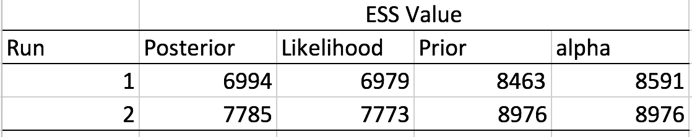

RevBayes - Final Assignment
============================

Methods:
---------
Phylogenetic relationships were inferred from concatenated UCE data for 60 species of Heroini cichlids (outgroup = Oreochromis niloticus, Onil_1675) in RevBayes version 1.0.4. UCE data character length was 11,329 bp. Initially, a [GTR+G+I model](http://revbayes.github.io/tutorials.html) was selected and implemented to run two independent replicates under default settings for one million generations (iterations) with a burn-in of 10%. Due to time constraints, the number of generations were reduced to ~97,000.
Following analyses, Tracer was used to visually examine traces and ESS values for parameters (Fig 1; Table 1). 

**Figure 1. Good mixing for both MCMC runs.**

**Table 1. ESS values for parameters for two independent MCMC runs.**

Results:
---------
Concordant topologies were obtained for the phylogenetic relationships generated from the two independent runs mentioned above. 

**Figure 2. Phyologenetic relationships of Heroini cichlids - Run 1.**

**Figure 3. Phyologenetic relationships of Heroini cichlids - Run 2.**

